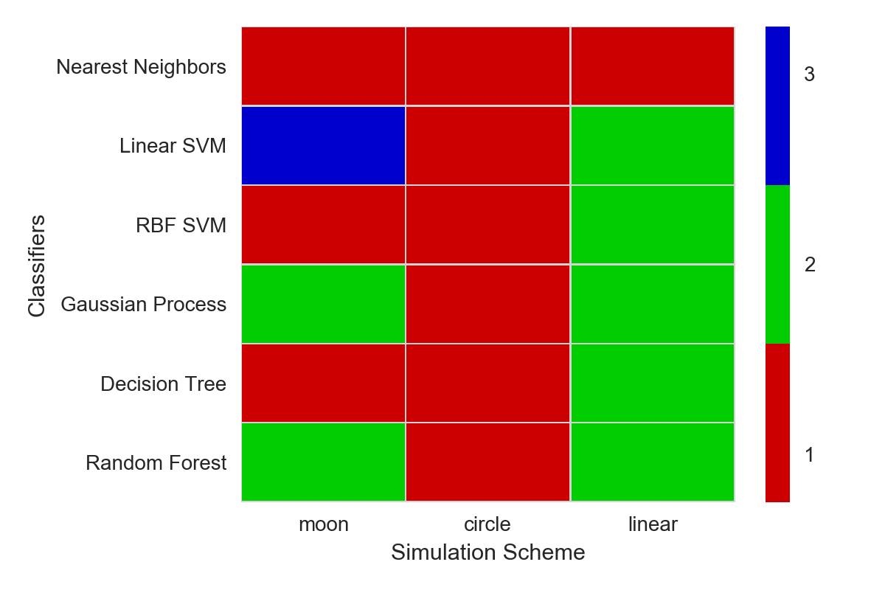

# predict_MC: Missing Imputation with Monte Carlo in Prediction

One common problem in data science is the missing value. We often fit our models on a cleaned dataset with few missing values, 
yet when predicting, some of the predictors could have a large number of missing values. One major way to deal with missing values
is to do missing imputation, which is aimed at filling the missing value with a "most probable" value. Simple options are (sample) mean, 
median of the variable or just impute with a fixed value in some case (e.g., 0 in the case of tree-based models). Sophisticated options 
include (Multivariate Imputation by Chained Equations)[https://cran.r-project.org/web/packages/mice/mice.pdf], etc. Those methods are
relying on different assumptions and generally offer very different performances in distinct data scenarios. What we are proposing in
this python module (R package coming soon) is to do missing imputation with a Monte Carlo methods. Because what we really care
about is the prediction rather than the exact value in this missing field, instead of feeding a single
value into the missing field, we can randomly select a bunch of values from the non-missing values of this variable and make predictions 
with those selected values, the average of predictions will be the final prediction. The advantage of this approach is that: 1) it will be 
insensitive to the underlying distribution of variable with missing values; 2) it does not assume any relationship between the predictors (for now).

With the approach, we did a simulation study to compare with the simple imputation methods (median, mean, 0) in 3 different data scenarios of binary 
class response(linear, moon-shaped and circle-shaped) and 6 different models (KNN, Linear SVM, RBF SVM, Naive Bayes, Decision Tree and Random Forest). 
We randomly pick 25% of one variable of test data to be missing and apply 4 imputation methods to make predictions. We calculate the accuracies resulting
from different data scenarios x model x imputation and rank them by imputation methods. In the plot below we show the rank of Monte Carlo imputation in
4 methods in different cases. We can see in more than half of the cases, it ranked the first and there is only one case it ranked 3rd of 4 methods.  
